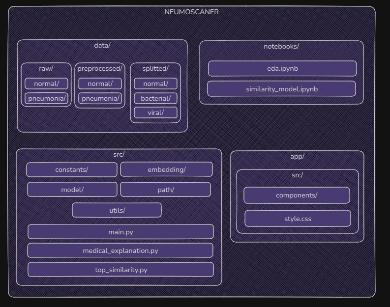

# NeumoScan

> An artificial intelligence system to predict and classify pneumonia cases from chest X-ray images.

##  Project Description

NeumoScan is a deep learning-based tool designed to detect pneumonia from chest X-ray images. Beyond determining the presence of pneumonia, it can classify it as **bacterial** or **viral**. The main goal is to support healthcare professionals in making fast and accurate diagnoses using artificial intelligence.

## Repository Structure

## How to Use

1) Upload an X-ray image via the web interface.

2) The model will analyze the image and display:

Whether pneumonia is present or not.

The type: bacterial or viral.

A textual explanation of the result.

Results powered by similarity models and deep learning.

## Technologies Used

Python 

Vue.js 

Jupyter Notebooks

Deep Learning for image classification

Medical similarity models
